# Wizard Card Game - UML Class Diagram

```mermaid
%%{init: {'theme':'base', 'themeVariables': { 'fontSize':'16px'}}}%%
classDiagram
    %% Core Actor Hierarchy
    class Actor {
        <<abstract>>
        #int healthPoints
        #int manaPoints
        #List~SpellCard~ hand
        #List~StatusEffect~ effects
        +drawCards(int)
        +takeDamage(int)
        +heal(int)
        +spendMp(int) boolean
        +addEffect(StatusEffect)
        +startTurnEffects()
        +getName()* String
    }

    class Player {
        -PlayerCustomization customization
        +Player(hp, mp, customization)
        +getName() String
        +addStartingMp()
    }

    class Enemy {
        -EnemyCustomization customization
        +Enemy(hp, mp, customization)
        +getName() String
        +addHp(int)
        +addMp(int)
    }

    Actor <|-- Player
    Actor <|-- Enemy

    %% Customization
    class PlayerCustomization {
        -String face
        -String hat
        -String robeColor
        -String staff
        -String name
        +PlayerCustomization(face, hat, robe, staff, name)
    }

    class EnemyCustomization {
        -String face
        -String hat
        -String robeColor
        -String staff
        -String name
        +EnemyCustomization(PlayerCustomization)
    }

    Player *-- PlayerCustomization
    Enemy *-- EnemyCustomization

    %% Game Controller (Singleton)
    class GameController {
        <<Singleton>>
        -GameController instance$
        -Player player
        -Enemy enemy
        -Deck deck
        -DeckIterator deckIterator
        -BattleState currentState
        -List~String~ actionLog
        +getInstance()$ GameController
        +startGameWithCustomizations(Player, Enemy)
        +changeState(BattleState)
        +playCard(Actor, String, Actor)
        +checkGameEnd() boolean
        +resetGame()
    }

    GameController o-- Player
    GameController o-- Enemy
    GameController o-- Deck
    GameController o-- DeckIterator
    GameController o-- BattleState
    GameController ..> SpellCardFactory : uses to create deck

    %% Card System
    class SpellCard {
        -Spell spell
        +SpellCard(Spell)
        +getSpell() Spell
    }

    class Deck {
        -List~SpellCard~ cards
        +Deck(List~SpellCard~)
        +shuffle()
        +drawCard() SpellCard
        +iterator() DeckIterator
        +size() int
    }

    class DeckIterator {
        <<interface>>
        +hasNext() boolean
        +next() SpellCard
    }

    class DeckIteratorImpl {
        -List~SpellCard~ cards
        -int index
        +hasNext() boolean
        +next() SpellCard
    }

    DeckIterator <|.. DeckIteratorImpl
    Deck o-- SpellCard
    Deck ..> DeckIterator : creates
    SpellCard o-- Spell
    Actor o-- SpellCard

    %% Spell Factory
    class SpellCardFactory {
        <<Factory>>
        +create(String)$ SpellCard
        +createMultiple(String, int)$ List~SpellCard~
    }

    SpellCardFactory ..> SpellCard : creates
    SpellCardFactory ..> Spell : instantiates

    %% Spell Hierarchy (Template Method)
    class Spell {
        <<abstract>>
        #String name
        #int manaCost
        #String description
        +Spell(name, cost, desc)
        +cast(Actor, Actor) void
        +applyEffect(Actor, Actor)* void
    }

    class Fireball {
        +applyEffect(Actor, Actor)
    }

    class Heal {
        +applyEffect(Actor, Actor)
    }

    class Shield {
        +applyEffect(Actor, Actor)
    }

    class Lightning {
        +applyEffect(Actor, Actor)
    }

    class IceBlast {
        +applyEffect(Actor, Actor)
    }

    class Meteor {
        +applyEffect(Actor, Actor)
    }

    class PoisonCloud {
        +applyEffect(Actor, Actor)
    }

    class Drain {
        +applyEffect(Actor, Actor)
    }

    class Thunderbolt {
        +applyEffect(Actor, Actor)
    }

    class Curse {
        +applyEffect(Actor, Actor)
    }

    class Regeneration {
        +applyEffect(Actor, Actor)
    }

    Spell <|-- Fireball
    Spell <|-- Heal
    Spell <|-- Shield
    Spell <|-- Lightning
    Spell <|-- IceBlast
    Spell <|-- Meteor
    Spell <|-- PoisonCloud
    Spell <|-- Drain
    Spell <|-- Thunderbolt
    Spell <|-- Curse
    Spell <|-- Regeneration

    %% Spell uses Actor for casting
    Spell ..> Actor : casts on

    %% Status Effects
    class StatusEffect {
        <<interface>>
        +onTurnStart(Actor)
        +isExpired() boolean
        +refresh(StatusEffect)
    }

    class BurnEffect {
        -int duration
        +onTurnStart(Actor)
        +isExpired() boolean
    }

    class FreezeEffect {
        -int duration
        +onTurnStart(Actor)
        +isExpired() boolean
    }

    class PoisonEffect {
        -int duration
        +onTurnStart(Actor)
        +isExpired() boolean
    }

    class RegenEffect {
        -int duration
        +onTurnStart(Actor)
        +isExpired() boolean
    }

    class ShieldEffect {
        -int absorbAmount
        +onTurnStart(Actor)
        +isExpired() boolean
        +absorb(int) int
    }

    class StunEffect {
        -int duration
        +onTurnStart(Actor)
        +isExpired() boolean
    }

    class WeakenEffect {
        -int duration
        +onTurnStart(Actor)
        +isExpired() boolean
    }

    StatusEffect <|.. BurnEffect
    StatusEffect <|.. FreezeEffect
    StatusEffect <|.. PoisonEffect
    StatusEffect <|.. RegenEffect
    StatusEffect <|.. ShieldEffect
    StatusEffect <|.. StunEffect
    StatusEffect <|.. WeakenEffect
    Actor o-- StatusEffect

    %% Spell to StatusEffect relationships
    Fireball ..> BurnEffect : creates
    IceBlast ..> FreezeEffect : creates
    PoisonCloud ..> PoisonEffect : creates
    Regeneration ..> RegenEffect : creates
    Shield ..> ShieldEffect : creates
    Lightning ..> StunEffect : creates
    Curse ..> WeakenEffect : creates

    %% State Pattern
    class BattleState {
        <<interface>>
        +enter()
        +nextState()
        +castSpell(String)
    }

    class PlayerTurnState {
        -GameController controller
        +PlayerTurnState(GameController)
        +enter()
        +nextState()
        +castSpell(String)
    }

    class EnemyTurnState {
        -GameController controller
        +EnemyTurnState(GameController)
        +enter()
        +nextState()
    }

    BattleState <|.. PlayerTurnState
    BattleState <|.. EnemyTurnState
    PlayerTurnState o-- GameController
    EnemyTurnState o-- GameController
    PlayerTurnState ..> Player : controls
    PlayerTurnState ..> Enemy : targets
    EnemyTurnState ..> Enemy : controls
    EnemyTurnState ..> Player : targets

    %% AI
    class EnemyAI {
        +chooseSpell(Enemy)$ SpellCard
    }

    EnemyTurnState ..> EnemyAI : uses
    EnemyAI ..> Enemy : analyzes
    EnemyAI ..> SpellCard : selects

    %% UI
    class GameUI {
        -GameController gameController
        -BorderPane root
        -VBox actionLogBox
        -HBox handBox
        +start(Stage)
        +refreshUI()
        -showCustomizationScreen(Stage)
        -showBattleScreen(Stage)
        -showVictoryScreen(Stage)
        -showDefeatScreen(Stage)
    }

    class CustomizationScreen {
        -Stage stage
        +CustomizationScreen(Stage)
        +show()
    }

    GameUI o-- GameController
    GameUI ..> CustomizationScreen : uses
    CustomizationScreen ..> PlayerCustomization : creates
    CustomizationScreen ..> EnemyCustomization : creates
    CustomizationScreen ..> Player : instantiates
    CustomizationScreen ..> Enemy : instantiates
    CustomizationScreen ..> GameController : initializes
```

## Design Patterns Used

### 1. **Singleton Pattern**

-   `GameController` - Ensures single game instance

### 2. **Factory Pattern**

-   `SpellCardFactory` - Creates spell cards by name

### 3. **Template Method Pattern**

-   `Spell.cast()` - Defines casting algorithm
-   Subclasses implement `applyEffect()` for specific behaviors

### 4. **State Pattern**

-   `BattleState` interface with `PlayerTurnState` and `EnemyTurnState`
-   Manages turn-based gameplay transitions

### 5. **Iterator Pattern**

-   `DeckIterator` - Iterates through the deck of cards

## Key Relationships

### Inheritance (extends/implements)

-   `Actor` → `Player`, `Enemy`
-   `Spell` → `Fireball`, `Heal`, `Shield`, `Lightning`, `IceBlast`, `Meteor`, `PoisonCloud`, `Drain`, `Thunderbolt`, `Curse`, `Regeneration`
-   `BattleState` ← `PlayerTurnState`, `EnemyTurnState`
-   `StatusEffect` ← `BurnEffect`, `FreezeEffect`, `PoisonEffect`, `RegenEffect`, `ShieldEffect`, `StunEffect`, `WeakenEffect`
-   `DeckIterator` ← `DeckIteratorImpl`

### Composition (strong ownership)

-   `GameController` contains `Player`, `Enemy`, `Deck`, `DeckIterator`, `BattleState`
-   `Player` contains `PlayerCustomization`
-   `Enemy` contains `EnemyCustomization`
-   `Actor` contains `List<SpellCard>`, `List<StatusEffect>`
-   `Deck` contains `List<SpellCard>`
-   `SpellCard` contains `Spell`
-   `PlayerTurnState` / `EnemyTurnState` contains `GameController` reference

### Association (uses/depends on)

-   `Spell` casts on → `Actor`
-   `SpellCardFactory` creates → `SpellCard`, instantiates → `Spell`
-   `GameController` uses → `SpellCardFactory` to create deck
-   `Deck` creates → `DeckIterator`
-   `EnemyTurnState` uses → `EnemyAI`
-   `EnemyAI` analyzes → `Enemy`, selects → `SpellCard`
-   `PlayerTurnState` controls → `Player`, targets → `Enemy`
-   `EnemyTurnState` controls → `Enemy`, targets → `Player`
-   `GameUI` uses → `CustomizationScreen`, owns → `GameController`
-   `CustomizationScreen` creates → `PlayerCustomization`, `EnemyCustomization`
-   `CustomizationScreen` instantiates → `Player`, `Enemy`
-   `CustomizationScreen` initializes → `GameController`

### Spell → StatusEffect Creation

-   `Fireball` creates → `BurnEffect`
-   `IceBlast` creates → `FreezeEffect`
-   `PoisonCloud` creates → `PoisonEffect`
-   `Regeneration` creates → `RegenEffect`
-   `Shield` creates → `ShieldEffect`
-   `Lightning` creates → `StunEffect`
-   `Curse` creates → `WeakenEffect`